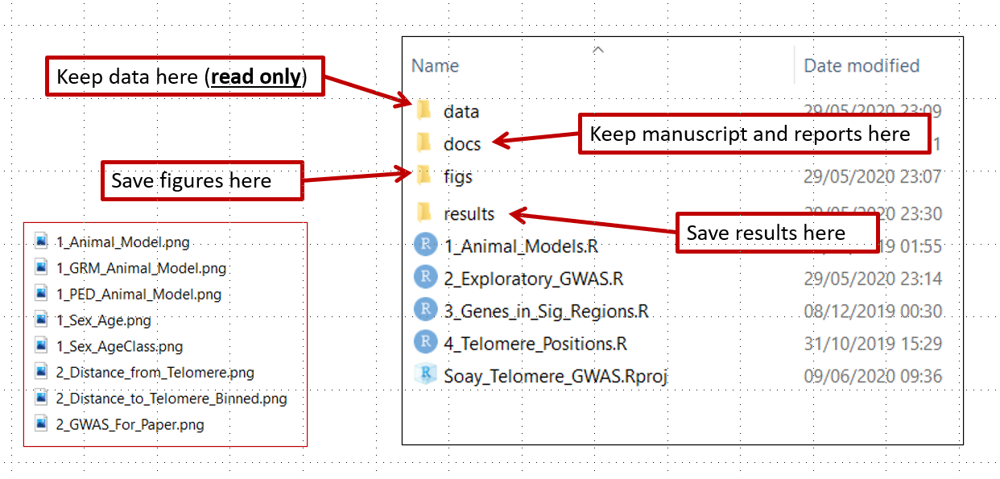
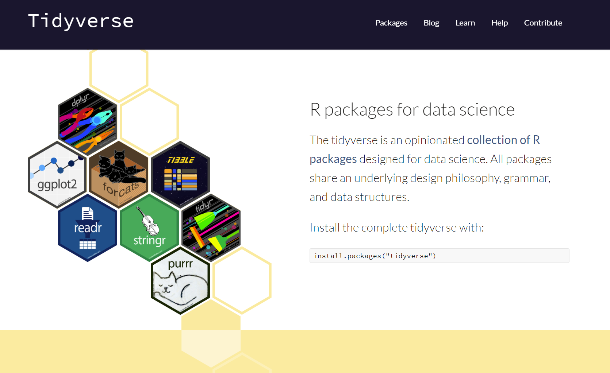
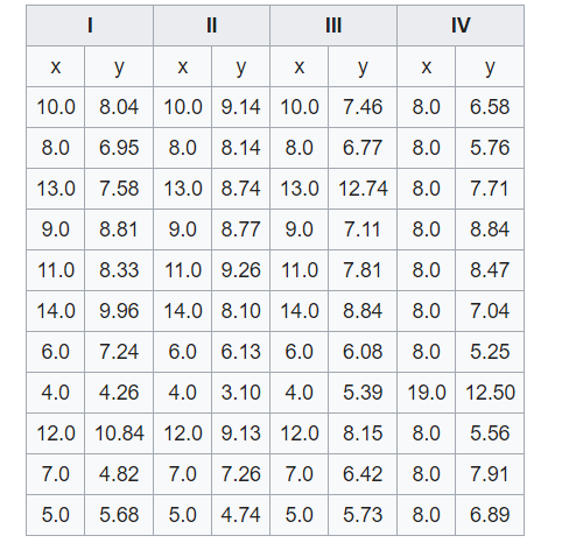

```{r setup, include=FALSE}
#library(learnr)
```

## Introduction

This tutorial is based on information from [Our Coding Club](https://ourcodingclub.github.io/) and [R4all](http://r4all.org/). The datasets for this tutorial can be downloaded from <https://github.com/susjoh/E4StatsTutorials>

### What is **R**?

**R** began its life in New Zealand in 1993 as a language and environment for statistical computing and graphics. It is an interpreted programming language, meaning that rather than pointing and clicking, the user types in commands. It is **free** and works across all platforms.

### Why use **R**?

> "This is R. There is no if. Only how."\
> -- Simon 'Yoda' Blomberg, R-help (April 2005)

Almost anything is possible in **R**. It is fast becoming the *lingua franca* of academic research, statistics and data science. It is used for:

-   Processing and tidying data
-   Statistical analyses
-   Data visualistion (`ggplot`)
-   Creating interactive web applications (`shiny`)
-   Generating reports and presentations (`knitr`, `slidify`)
-   Creating portable projects (**RStudio** Projects)

The analytical power of **R** lies in its many packages (20,406 as of 12th Feb 2024). Hundreds of these are written for geoscience, ecology, evolutionary biology, chemistry, etc.. A list of packages are hosted on the Comprehensive R Archive Network (known as **CRAN**): <https://cran.r-project.org/>

## Getting Started: **R** and **RStudio**.

### Installing **R** and **RStudio**

**R** can be downloaded from the CRAN website. Whilst the CRAN download version provides a simple user interface, we recommend that **R** is run through the software **RStudio** This is open-source, free, and available [here](http://www.rstudio.com/).

### Creating an **R** Project.

Using **R** Projects (`.RProj`) allows easier file imports, improved reproducibility and collaboration. This is because it tells **R** where to look for data files and scripts, meaning that a script can be run different machines and environments without any problems. Projects can be created using `File > New Project` and following the instructions.

We have provided the project `Intro_to_R.RProj`. Opening this file will open **RStudio**. If you would rather not use projects, you can set the working directory by using the command `setwd()` or by selecting `Session > Set working directory > Choose directory`

On the Files tab in the **lower right**, you will see the files in the current working directory. This will be useful later when we tell **R** to load files. You can check the working directory by typing `getwd()`.

### Structuring an **R** Project.

Using a good project layout keeps the data reliable, portable and reproducible. This makes it easier for you or a collaborator to pick up the project after a break. There is no single way to structure a project, but an suggestion is shown in Figure 1. This is based on a blog post on Nice R Code available [here](https://nicercode.github.io/blog/2013-04-05-projects/).



***Figure 1: Example structure for a portable R project.***

-   `data` contains all data used in the analysis and should be treated as **read only** - these files should never be edited or overwritten. Rather, they should be processed within R scripts.
-   `docs` contains the paper and/or reports associated with the analysis (in Word, R Markdown, LaTeX, etc).
-   `figs` contains any figures generated by R scripts.
-   `results` contains any simulation outputs, processed data etc. NB. Data in `figs` and `results` can be treated as disposable.
-   `[filename].R` are R scripts. You can split your workflow into units that are logical for you, such as (a) load, merge and clean data, (b) analyse the data and (c) create outputs such as results tables and figures. Some researchers use a numbering method so that the order in which to run different scripts is clear.
-   `[filename].Rproj` is the portable R project.

\*\* The take-home message is to start your analysis from copies of the raw data, doing any cleaning, transforming, merging and so on in scripts. Always comment and document your code thoroughly, explain what it is doing and why.\*\*

### Using **RStudio**

Open `Intro_to_R.RProj` and create a new **R** Script (`File > New File > R Script`). **RStudio** should look like Figure 2.

{width="100%"}

***Figure 2. The RStudio Environment. Adapted from OurCodingClub.github.io***

On the **lower left** is the **Console** pane - this is the engine of **R**. You can give instructions to **R** by directly typing at the prompt (`>`).

On the **upper left** is your **R** Script - here, you can write commands and send them to the console by clicking `Run` or by typing `Ctrl-Enter`. `#` is the comment character in **R**.

On the **lower right**, you can browse the packages installed on your machine, open files and search **R** Help. This pane will also show plots when we run them later in the practical.

### **Exercise 1**

Try running some basic commands directly in the console and from the **R** Script:

```{r Basic_commands_A, eval = F}
2+3
1:10
seq(from = 1, to = 20, by = 4)
mean(c(3, 6, 9, 3, 6, 7))
```

Let's assign a sequence of numbers to an object, `x`:

```{r Basic_commands_B, eval = F}
x <- 1:10
x
y <- seq(from = 0, to = 4.5, by = 0.5)
y
```

You can see that in the upper right pane, we can see this new objects `x` and `y` in the environment.

<details>

<summary><font color="blue">**Click here for advanced exercises**</font></summary>

Read the next short paragraph on finding help within R. Use this information to generate two vectors of length 100.

`x` is normally distributed with a mean of 0 and a standard deviation of 1.

`y` is uniformly distributed with a range between 0 & 1.

</details>

------------------------------------------------------------------------

### Finding Help within **R**.

The fastest way to find help in **R** is to search using `?`. For example:

```{r eval = F}
?mean
```

should bring up a help page for the function `mean()` in the lower right corner. Typing two question marks will search all help files and return a list of those that match.

```{r eval = F}
??mean
??"standard error"
```

### **Exercise 2.**

1.  Using only `?` and/or `??`, find a function for calculating the standard deviation. What is the standard deviation of `x`?

2.  Using `?`, find the help file for the `sort()` function. Sort `x` and `y` in reverse order.

### Troubleshooting and finding help outside of **R**.

-   [Coding Club Tutorials & Useful Links](https://ourcodingclub.github.io/)
-   [Stack Overflow](https://stackoverflow.com/): Try searching with the tag [R]
-   [**RStudio** Cheatsheets](https://www.rstudio.com/resources/cheatsheets/)

## The Tidyverse.



In these practicals, we are going to use a suite of packages known as the `tidyverse`. These can be installed by running the following:

```         
install.packages(tidyverse)
```

This installs the library from CRAN. It may ask you to select a mirror - select the one that which is geographically closest, or the RStudio Global mirror.

Then each time we use R, we need to load the `tidyverse` package. It is good practice to do this at the beginning of the script when you are setting up the working environment.

```{r, message = F}
library(tidyverse)
```

There are three sub-packages within the tidyverse that are used within this practical:

-   `readr` - this is a fast way to read in "rectangular" data (e.g. tables).
-   `dplyr` - a packages for common data manipulation tasks.
-   `ggplot2` - the industry standard for data visualisation.

## Loading data into **R**.

Now that we are familiar with the **RStudio** environment, it's time to start working with real data. In the folder `data`, you have been provided with a single dataset on Peruvian Soil in two common formats - `.txt` (tab-delimited) and `.csv` (comma-delimited).

Using **R** Projects means that the working directory is the same as the .Rproj file. We will use `read_delim()` to read in the data-set. Try typing the following into your script, and guiding the command to the `.csv` version of the data file using the `Tab` key:

```{r eval = F}
Peru_Soil_Data <- read_delim("
```

You should now have the following code in your script:

```{r}
Peru_Soil_Data <- read_delim("data/Peru_Soil_Data.csv")
```

You can also use the base R function `read.table()` which offers more flexibility on defining various features about the input files.

### Exercise 3.

* Read the file `Peru_Soil_Data.txt` into **R**. Check the loaded object using the `head()` function. Do you need additional arguments to read in the file properly?

* The object `Peru_Soil_Data` is a type of object known as a **data frame**. You should ALWAYS check the data visually by clicking on its entry in the Environment tab, and/or using functions in base **R** for exploring data e.g. `head()` and `str()` and `glimpse()`. Try these out.

<details>

<summary><font color="blue">**Click here for advanced exercises**</font></summary>

Read in `data/Peru_Soil_Data.txt` with `read.table()`. If it doesn't work, check the help file. If it does work, has all the data read in properly?

Read in `docs/Peru_Soil_Data_Problematic.txt` with `read.table()`. If it doesn't work, check the help file. If it does work, has all the data read in properly?

</details>

## Data management in **R**.

Exploring and manipulating data is fundamental to data analysis. In this section, we will briefly cover how to sort and filter the soil dataset. There are several approaches to doing this in the base code of **R**, but here we will use on the functions `select()`, `filter()` and `arrange()` from the tidyverse package `dplyr`.

### Sorting data with `arrange()`

There are occasions where it is useful to have sorted data, either because we would like to examine it, or for some types of statistical analyses i.e. with time-series data. The `arrange()` function sorts data frames as so:

```{r eval = F}
# sort by Soil pH value:
arrange(Peru_Soil_Data, Soil_pH) 
# sort by decreasing Soil pH value:
arrange(Peru_Soil_Data, -Soil_pH) 
# sort by habitat and then soil pH within habitat:
arrange(Peru_Soil_Data, Habitat, Soil_pH) 
```

These can be saved back to the `Peru_Soil_Data` object like so:

```{r}
Peru_Soil_Data <- arrange(Peru_Soil_Data, Habitat, Soil_pH) 
```

### Sub-setting columns with `select()`

At its simplest, columns can be selected using their numeric references in square brackets (**after** the comma):

```{r eval = F}
Peru_Soil_Data[,1]
Peru_Soil_Data[,3:5]
Peru_Soil_Data[,c(1, 4, 5)]
Peru_Soil_Data[,c("Habitat", "Phosphorus")]
```

It is not recommended to use numerical references, as addition or removal of columns can lead to mistakes. The best solution is to use the column names themselves. A convenient way to do this is to use the `dplyr` `select()` function, which will select or remove columns of the data. Try running:

```{r, eval = F}
select(Peru_Soil_Data, River_Basin)
select(Peru_Soil_Data, -River_Basin)
```

More than one column can be selected or removed by adding more column names:

```{r, eval = F}
select(Peru_Soil_Data, River_Basin, Magnesium, Sodium)
select(Peru_Soil_Data, -River_Basin, -Magnesium, -Sodium)
```

### Adding columns.

New columns can be added to the data containing information or calculations that you are interested in. We can do this in standard base **R** using the code `$`, which can be used to call existing variables from a data frame. For example, river basin can be called as so:

```{r, eval = F}
Peru_Soil_Data$River_Basin
```

Columns can be added by creating new variables within the data frame. Here, we can create a new column called `log_Calcium` which takes the `log_{10}` of the Calcium column:

```{r, eval = F}
Peru_Soil_Data$log_Calcium <- log10(Peru_Soil_Data$Calcium)

head(select(Peru_Soil_Data, Site, Calcium, log_Calcium))
```

### Sub-setting rows with `filter()`

Sub-setting data by rows is one of the most common tasks carried out in data manipulation steps. Again, at it's simplest, rows can be selected using their numeric references in square brackets (**before** the comma):

```{r, eval = F}
Peru_Soil_Data[1,]
Peru_Soil_Data[1:5,]
```

However, this is clearly not useful if we wish to select rows based on a particular criteria. For this, we can used the `filter()` function, specifying an argument with the following logical operators:

| Operator | Function                 |
|----------|--------------------------|
| `<`      | less than                |
| `>`      | greater than             |
| `=<`     | less than or equal to    |
| `=>`     | greater than or equal to |
| `==`     | equals                   |
| `!=`     | does not equal           |
| `%in%`   | matches                  |

For example, in the soil data, we may wish to select only rows for the floodplain habitat and the Los Amigos River Basin:

```{r echo = F, eval = F}
filter(Peru_Soil_Data, Habitat == "floodplain", River_Basin == "Manu")
```

### **Exercise 4.**

1.  Create a new data frame, `Peru_Upland_Soil`, which includes row only from upland habitats.
2.  Edit this data frame so that it only includes data from the Manu and Los Amigos river basins (Hint: use `%in%`)
3.  Edit this data frame again so that it is sorted by increasing Calcium levels.
4.  Create a new column called `Sum_Ca_Mg` that is the sum of the calcium and magnesium columns.

<details>

<summary><font color="blue">**Click here for advanced exercises**</font></summary>

5.  Explore the `group_by()` and `summarise()` function in `dplyr` using `?` or a search engine. Use these functions to create a data frame with the mean Phosphorus and Calcium measures for each habitat.

6.  There was a problem with the device measuring the Calcium concentrations in Los Amigos. Can you multiply *only* these data points by two within the data frame??

</details>

## Data visualisation with `ggplot2`

Data visualisation is the visual representation of data in the form of plots, charts, maps and infographics. It is an accessible way to identify patterns and trends in your data, but can also tell you about the quality of your data and how it should be analysed.

Data visualisation is an important part of our every day lives e.g such as on the BBC News (who use R to produce their graphics - see [here](https://bbc.github.io/rcookbook/) on how they do it!)

One of **R**'s most powerful tools is its ability to produce publication quality graphics in an automated and reproducible way. 

#### The first step of any analysis: PLOT YOUR DATA!

A good illustration of why this is important is using a dataset called the Anscombe's Quartet:



Each of these 4 data sets has an almost identical results for linear regression (R2, slope and intercept):

```{r Ex1, exercise = TRUE}
summary(lm(anscombe$y1 ~ anscombe$x1))
```

However, plotting these figures shows a different picture (literally and metaphorically):

```{r echo = F}
anscombe_plot <- rbind(as.matrix(anscombe)[,c(1, 5)],
                       as.matrix(anscombe)[,c(2, 6)],
                       as.matrix(anscombe)[,c(3, 7)],
                       as.matrix(anscombe)[,c(4, 8)])
anscombe_plot <- data.frame(anscombe_plot)
anscombe_plot$Dataset <- rep(paste("Dataset", 1:4), each = 11)

anscombe_plot <- ggplot(anscombe_plot, aes(x1, y1)) +
  stat_smooth(method = "lm", se = F, fullrange = TRUE, colour = "lightblue") +
  geom_point() +
  facet_wrap(~Dataset) +
  theme_bw() +
  labs(x = "x", y = "y")

```

```{r Ex2, exercise = TRUE}
anscombe_plot
```

How would you change your data analysis based on the patterns that you visualise?

## Simple graphics in R (base graphics)

One of **R**'s most powerful tools is its ability to produce publication quality graphics in an automated and reproducible way.

Base **R** contains graphical tools for simple, exploratory graphics. These are easily called with functions such as `hist()` and `plot()`:

```{r Ex3, exercise = T}

# histogram
hist(Peru_Soil_Data$Calcium)

# plot
plot(Magnesium ~ Calcium, data = Peru_Soil_Data, col = "red")

# boxplot
boxplot(Magnesium ~ River_Basin, data = Peru_Soil_Data)
```

You can do many things you require in base graphics, but common actions and customisation are difficult. Base graphics are good for quick data exploration, but for everything else we recommend the graphics library `ggplot2`. If you want to explore customisation of base graphics, you can access my tutorial [here](https://rstudio-pubs-static.s3.amazonaws.com/7953_4e3efd5b9415444ca065b1167862c349.html).

## Anatomy of a Graph

What's wrong with this graph?

```{r echo = F, warning=F}
library(palmerpenguins)
ggplot(penguins, aes(bill_length_mm, bill_depth_mm, colour = species)) +
  geom_point(size = 8) +
  theme_classic() +
  theme(legend.position = "none",
        axis.text.y = element_text(size = 6),
        panel.background = element_rect(fill = 'grey50')) +
  scale_colour_manual(values = c("grey60", "red", "green")) +
  labs(x = "Bill Length", y = "") +
  scale_x_continuous(breaks = seq(40, 60, 20)) 

```

<summary><font color="blue">**Click here for answers**</font></summary>

* Axes - no y label
* Axes - font size too small
* Axes - no units on x label
* Axes - units too spaced out on x
* Points - too large and obscure points behind
* Points - not colourblind friendly
* Points - not easily visible against background
* Figure - no legend
* Figure - no title or label
* Figure - it's ugly

</details>

If we fix these issues, then it can look a bit nicer:

```{r echo = F, message = F, warning=F}

ggplot(penguins, aes(x = bill_length_mm, y = bill_depth_mm, colour = species)) +    # Dataset and aesthetic properties
  geom_point(alpha = 0.8, size = 2) +                                       # Make a scatterplot, modify the transparency and size
  theme_bw() +                                                              # Use the bw theme to remove the grey background
  labs(x = "Bill Length (mm)", y = "Bill Depth (mm)", colour = "Species") + # Label the x, y and colour parameters
  scale_colour_brewer(palette = "Dark2") +                                  # Change the colour scheme
  stat_smooth(method = "lm") +                                              # Add a linear regression line
  scale_x_continuous(breaks = seq(20, 70, 5)) +                       # Change the scale on the x axis to seq(start, stop, interval)
  scale_y_continuous(breaks = seq(10, 30, 2))                         # Change the scale on the y axis to seq(start, stop, interval)

```

We will do this using the R library `ggplot2`.

## `ggplot2` - the grammar of graphics.

`ggplot2` is a plotting system in **R** which aims to take the best parts of base graphics and allow for easy plot customisation. It has extensive documentation and examples [here](https://ggplot2.tidyverse.org/reference/index.html)

The beauty of `ggplot2` is that you can build up the graph in different steps. The main steps can be summarised as follows: 

1.  **Data:** `ggplot()` Data with aesthetic (visual) properties (`aes()`).
2.  **Geom:** `geom_...()` The type of plot (line, point, box-plot, etc.)
3.  **Stat:** `stat_...()` Statistical transformations (regression lines, smoothers, etc)*
4. **Theme**  `theme() and others` How do you want your graph to look?
5+ **Other customisations** e.g. facetings, scales, zoom, etc.

* NB. every geom has a default statistic, so this component is not always specified.


## `ggplot2` basics - a scatterplot with `geom_point()`

We will do a worked example to investigate different aspects of plotting and customisation, using a new dataset, the Palmer penguins:

The first step is to specify our `Peru_Soil_Data` dataset in `ggplot2()`:

```{r Ex4, exercise = T}
ggplot(Peru_Soil_Data)
```

Then specify the aesthetic properties using `aes()`. In a scatterplot, we have x and y variables, which was specify as follows:

```{r Ex5, exercise = T}
ggplot(Peru_Soil_Data, aes(x = Calcium, y = Magnesium))

```

You can see by running this line alone, we have already run into a problem - there is no data plotted on the graph! This is because ggplot doesn't know what type of graph we want. We need to specify the `geom` i.e. the type of plot. For a scatterplot, this is `geom_point()`. We add this to our first layer with a `+` sign:

```{r Ex6, exercise = T}

ggplot(Peru_Soil_Data, aes(x = Calcium, y = Magnesium)) + 
  geom_point()

```
Note that it is common practise to put anything separated by `+` onto a new line. This way, you can build up the graph line by line.

### Adding a statistical test with `stat_smooth()`

The function `stat_smooth()` is built to "aid the eye in seeing patterns" in your data. Let's have a go by adding it as a new layer in our plot:


```{r Ex14, exercise = T}

ggplot(Peru_Soil_Data, aes(x = Calcium, y = Magnesium)) + 
  geom_point() +
  stat_smooth()

```

The default of this function is to do what is called a "loess" smoothing, a type of moving regression. Sometimes this is useful, but in our case we wish to specify a linear regression. We know that calling a linear regression can be done with `lm()`, which gives the intercept and slope:

```{r}
lm(Magnesium ~ Calcium, data = Peru_Soil_Data)
```

We can add a linear regression to our graph by specifying that we want to use `lm()` as our smooth function. We do this with `stat_smooth(method = "lm")`:

```{r Ex15, exercise = T}

ggplot(Peru_Soil_Data, aes(x = Calcium, y = Magnesium)) + 
  geom_point() +
  stat_smooth(method = "lm")

```

This runs a regression for us and plots the regression line and a shaded standard error. This indicates the amount of "wobble" in the line covers the 95% confidence interval. Our results show that Magnesium increases with increasing Calcium.


### Customisation

This graph looks good, but not amazing. We can now start to make modifications to improve the look of the graph.

#### Labels

We need to update the labels to contain the units of measurement. We can add this with `+` and `labs()`. Remember to put text in " "!

```{r Ex7, exercise = T}
ggplot(Peru_Soil_Data, aes(x = Calcium, y = Magnesium)) + 
  geom_point() +
  labs(x = "Calcium Concentration (mg/kg)", y = "Magnesium Concentration (mg/kg)")
```

#### Colour by a categorical variable.

A common action in R is to colour variables by a categorical or quantitative aspect of the data, in this case, `Habitat`. Let's start afresh:

```{r Ex9, exercise = T}
ggplot(Peru_Soil_Data, aes(x = Calcium, y = Magnesium)) + 
  geom_point()
```

In this case, because species is defined in the dataset `Peru_Soil_Data`, it is an aesthetic property of the data. Therefore, it has to be specified in `aes()`. We can add this using `col =` in the first line:

```{r Ex10, exercise = T}
ggplot(Peru_Soil_Data, aes(x = Calcium, y = Magnesium, col = Habitat)) + 
  geom_point()
```

#### Faceting

One nice feature of `ggplot2` is that you can facet your data based on a categorical variable. Let's go back to a simple graph again, and add the line `facet_wrap()` specifying `Habitat`:

```{r Ex12, exercise = T}

ggplot(Peru_Soil_Data, aes(x = Calcium, y = Magnesium)) + 
  geom_point()+
  facet_wrap(~Habitat)

```

### The finished graph

We can then combine the modifications we made above to make the full graph:

```{r}

ggplot(Peru_Soil_Data, aes(x = Calcium, y = Magnesium, col = Habitat)) + 
  geom_point()+
  stat_smooth(method = "lm") +
  labs(x = "Calcium Concentration (mg/kg)", y = "Magnesium Concentration (mg/kg)") +
  facet_wrap(~Habitat)

```

### Troubleshooting:

* Did you forget a `+` ?
* Is `+` at the end of the line?
* Did you put text into inverted commas?
* Anything in `aes()` does not need inverted commas.
* Labels and colours need inverted commas.


### Advanced exercise

Data can also be compared between two categorical variables.

3. Make a bar plot of the number of individuals of each sex within each species. Can you...

(a) Make the male and female bars appear next to each other?
(b) Change "male" and "female" to be capitalised?
(c) Add the species latin names to the x axis?
(d) Make the species names italic? (If you do this I will buy you a coffee!)

```{r echo = F}

library(stringr)
penguins_subset <- subset(penguins, !is.na(sex))

ggplot(penguins_subset, aes(x = species, fill = str_to_title(sex))) +
  geom_bar(position = "dodge", colour = "black") +
  labs(x = "Pygoscelis Species", fill = "Sex") +
  scale_x_discrete(labels = c("P. adeliae", "P. antarctica", "P. papua"))

```

<details><summary>**Answers:** [click]</summary>

```
# 1 

ggplot(penguins, aes(x = bill_depth_mm, fill = species)) +
geom_histogram(colour = "black") +
labs(x = "Bill Depth (mm)", fill = "Penguin species") +
facet_grid(species ~ sex)

# 2

penguins_subset <- subset(penguins, !is.na(sex))

ggplot(penguins_subset, aes(x = bill_depth_mm, fill = sex, colour = sex)) +
geom_density(alpha = 0.6) +
labs(x = "Bill Depth (mm)", fill = "Sex", colour = "Sex") +
facet_wrap(~species)

# 3 - without italic text as I can't be bothered - you can use expression()

library(stringr)
penguins_subset <- subset(penguins, !is.na(sex))

ggplot(penguins_subset, aes(x = species, fill = str_to_title(sex))) +
geom_bar(position = "dodge", colour = "black") +
labs(x = "Pygoscelis Species", fill = "Sex") +
scale_x_discrete(labels = c("P. adeliae", "P. antarctica", "P. papua"))

```
</details>

## `ggplot2` basics - a scatterplot with `geom_point()`

Now let's step up to two dimensional data and create a scatterplot with regression lines.

Let's use the same "good graph/bad graph" example with bill length and depth.

We specify our data and `aes()` with x and y, and a new geom, `geom_point()`

```{r Ex13, exercise = T}

ggplot(penguins, aes(x = bill_length_mm, y = bill_depth_mm)) +
  geom_point()

```

### Adding a statistical test with `stat_smooth()`

The function `stat_smooth()` is built to "aid the eye in seeing patterns" in your data. Let's have a go by adding it as a new layer in our plot:

```{r Ex14, exercise = T}

ggplot(penguins, aes(x = bill_length_mm, y = bill_depth_mm)) +
  geom_point() +
  stat_smooth()

```

The default of this function is to do what is called a "loess" smoothing, a type of moving regression. Sometimes this is useful, but in our case it is *not* useful. We need to specify that we want to use a linear regression.

We know that calling a linear regression can be done with `lm()`, which gives the intercept and slope:

```{r}
lm(bill_depth_mm ~ bill_length_mm, data = penguins)
```

We can add a linear regression to our graph by specifying that we want to use `lm()` as our smooth function. We do this with `stat_smooth(method = "lm")`:

```{r Ex15, exercise = T}

ggplot(penguins, aes(x = bill_length_mm, y = bill_depth_mm)) +
  geom_point() +
  stat_smooth(method = "lm")

```

This runs a regression for us and plots the regression line and a shaded standard error. This indicates the amount of "wobble" in the line covers the 95% confidence interval. Our results show that bill length decreases with bill depth.

Do you think this is true??

As we know, there is a lot of size differentiation between species, so lets start to group by colour:

```{r Ex16, exercise = T}

ggplot(penguins, aes(x = bill_length_mm, y = bill_depth_mm, colour = species)) +
  geom_point() +
  stat_smooth(method = "lm")

```

As you can see, the linear regressions are now grouped by their respective species. In this way, plotting our data showed us a new pattern that bill length and bill depth increase with each other within species.

### Specifying point colour

You may have noticed that the same colour scheme is being used again and again. It is possible to change this using the `scale_colour_...` functions. If you type `scale_colour_` and the tab key, you can see that there are many choices. The two that you will use for categorical functions are:

`scale_colour_manual()` - here you can specify the specific colours you would like in a `c()` vector.
`scale_colour_brewer()` - you can specify palettes that are defined [here](https://r-graph-gallery.com/38-rcolorbrewers-palettes_files/figure-html/thecode-1.png).

```{r Ex17, exercise = T}


ggplot(penguins, aes(x = bill_length_mm, y = bill_depth_mm, colour = species)) +
  geom_point() +
  scale_colour_manual(values = c("blue", "red", "purple"))

ggplot(penguins, aes(x = bill_length_mm, y = bill_depth_mm, colour = species)) +
  geom_point() +
  scale_colour_brewer(palette = "Set1")

ggplot(penguins, aes(x = bill_length_mm, y = bill_depth_mm, colour = species)) +
  geom_point()

```

### Specifying point transparency and size

Similar to our density points in the previous page, we can also adjust the transparency of the points using `alpha`:

```{r Ex18, exercise = T}

ggplot(penguins, aes(x = bill_length_mm, y = bill_depth_mm, colour = species)) +
  geom_point(alpha = 0.8)

ggplot(penguins, aes(x = bill_length_mm, y = bill_depth_mm, colour = species)) +
  geom_point(alpha = 0.4)

```

and adjust the point size:

```{r Ex19, exercise = T}

ggplot(penguins, aes(x = bill_length_mm, y = bill_depth_mm, colour = species)) +
  geom_point(alpha = 0.8, size = 3)

```

### Adjusting the scales

We have the graph above, but we might want to adjust the scale of the axes. We can do this using a new layer: `scale_x_continuous()` and `scale_y_continuous()`. We want to specify where the breaks occur. For example, on the x axis, we may wish to put a number every 5mm instead of 10mm.

We can specify this as a vector e.g. `c(35, 40, 45, 50, 55, 60)`, or we can use a command called `seq()`. This works as seq(start, stop, interval): in our case, `seq(35, 60, 5)`

```{r Ex20, exercise = T}


ggplot(penguins, aes(x = bill_length_mm, y = bill_depth_mm, colour = species)) +
  geom_point() +
  scale_x_continuous(breaks = seq(35, 60, 5))

```

### Saving a plot.

You've spent all this time making a nice plot - but how to save it? You can save by pointing and clicking in RStudio, but this becomes time consuming. A simpler way is to use `ggsave()`. This will save the most recently created plot. At the simplest level, you just specify a filename (`.png`, `.pdf`, `.jpg`):

```{r eval = F}

ggplot(penguins, aes(x = bill_length_mm, y = bill_depth_mm, colour = species)) +
  geom_point() +
  scale_x_continuous(breaks = seq(35, 60, 5))

ggsave("bill_morphology_plot.png")

```

This will automatically save with the dimensions that you have in your plot window. You can save with a fixed width and height as follows:

```{r}

ggsave("bill_morphology_plot.png", width = 15, height = 10, units = "cm")

```

Here is our final example graph:

```{r}

# penguins dataset, with x of bill length, y of bill depth, and colour by species +
# make a scatterplot with transparent points that are a bit larger +
# add linear regression lines +
# colour the points blue, red and purple +
# change the scale on the x axis to have a break every 5mm +
# label the axes and legend.

ggplot(penguins, aes(x = bill_length_mm, y = bill_depth_mm, colour = species)) +
  geom_point(alpha = 0.5, size = 3) +
  stat_smooth(method = "lm") +
  scale_colour_manual(values = c("blue", "red", "purple")) +
  scale_x_continuous(breaks = seq(35, 60, 5)) +
  labs(x = "Bill Length (mm)", y = "Bill Depth (mm)", colour = "Species")

```


### Exercise 2.

4. Create a scatterplot of bill depth (x) and flipper length (y).

(a) What happens when you colour the data points by bill length?

(b) Can you change the colour range to go from red to purple using `scale_colour_gradient()`? 

<details><summary>**Hint:** [click]</summary>

Hint: use the tab key to look at the command options :)

</details>

(c) Can you adjust the y axis scale to be every 20mm rather than 10mm?

(d) Can you define new axis and legend labels?

### Advanced exercise

It is possible to specify aesthetic properties of the graph within each `geom_...()` object. For example, these four commands give you the same graph. Note that in the third example, colour is still an aesthetic property of the data, and so must be in `aes()`:

```{r Ex21, exercise = T}

ggplot(penguins) +
  geom_point(aes(x = bill_length_mm, y = flipper_length_mm, colour = species))

ggplot(penguins, aes(x = bill_length_mm, y = flipper_length_mm, colour = species)) +
  geom_point()

ggplot(penguins, aes(x = bill_length_mm, y = flipper_length_mm)) +
  geom_point(aes(colour = species))

ggplot() +
  geom_point(data = penguins, aes(x = bill_length_mm, y = flipper_length_mm, colour = species))

```

Any data and `aes()` defined within `ggplot` will be applied *globally* to the graph (i.e. every layer), whereas when it is defined within a `geom_...()`, it will be applied *specifically* to that geom.

5. Take your graph from 4, and:

(a) Colour the points by species and set them to have different shapes. Try to get one legend and not two.

(b) Using the rules above, make a single regression line over the whole data set, like the example below.

(c) Use the tab key to explore the layer `theme_...()` and use it to make your graph look nicer.

(d) Use a search function to find out how to place the legend at the top of your graph. [If your solution doesn't work, make sure it occurs after your layer for answer (c)]

(e) Using `labs()`, can you add a caption that describes the slope, intercept and R2 of the regression?

```{r echo = F, warning=F, message=F}

ggplot(penguins, aes(x = bill_length_mm, y = flipper_length_mm)) +
  geom_point(aes(colour = species, shape = species), na.rm = T) +
  stat_smooth(method = "lm") +
  scale_y_continuous(breaks = seq(160, 240, 20)) +
  labs(x = "Bill Length (mm)", y = "Flipper Length (mm)", colour = "Bill Length (mm)", shape = "Bill Length (mm)", caption = "Slope = 1.69, Intercept = 126.68") +
  theme_bw() +
  theme(legend.position = "top")

```

<details><summary>**Answers:** [click]</summary>

```
# 4 

ggplot(penguins, aes(x = bill_length_mm, y = flipper_length_mm, colour = bill_length_mm)) +
geom_point() +
scale_colour_gradient(low = "red", high = "purple") +
scale_y_continuous(breaks = seq(160, 240, 20)) +
labs(x = "Bill Length (mm)", y = "Flipper Length (mm)", colour = "Bill Length (mm)")

# 5

x <- lm(flipper_length_mm ~ bill_length_mm, data = penguins)
x

ggplot(penguins, aes(x = bill_length_mm, y = flipper_length_mm)) +
geom_point(aes(colour = species, shape = species), na.rm = T) +
stat_smooth(method = "lm") +
scale_y_continuous(breaks = seq(160, 240, 20)) +
labs(x = "Bill Length (mm)", y = "Flipper Length (mm)", colour = "Bill Length (mm)", shape = "Bill Length (mm)", caption = "Slope = 1.69, Intercept = 126.68") +
theme_bw() +
theme(legend.position = "top")

# also possible to put `paste0("Slope = ", x$coefficients[2], ", Intercept = ", x$coefficients[1])` for the caption!


```
</details>


## `ggplot2` basics - boxplots and friends.

The last type of plot we will look at is the boxplot and its relatives. This is a useful type of visualisation for comparing the distribution of a continuous variable (such as flipper length) with a categorical or discrete variable (such as species). We have done this before with `geom_histogram()` and `geom_density()`, but we can also do this in a more formal capacity with `geom_boxplot()`:


```{r Ex22, exercise = T}


ggplot(penguins, aes(x = flipper_length_mm, fill = species)) +
  geom_density(alpha = 0.5)

ggplot(penguins, aes(x = species, y = flipper_length_mm)) +
  geom_boxplot()

ggplot(penguins, aes(x = species, y = flipper_length_mm)) +
  geom_boxplot(notch = T)

```

Boxplots are useful as they show the distribution of the data. This is nicely illustrated by this figure in "R for Data Science" by Wickham, Çetinkaya-Rundel and Grolemund (2023). As an aside, this book is *amazing* and is freely available online here: https://r4ds.hadley.nz/


You can also see that I have added a notch with `notch = T` - this is a good visual indicator that if notches do not overlap, then the groups are significantly different from each other. This should always be backed up with a statistical test e.g. ANOVA or glm!

### `geom_violin()`

But boxplots are also *not* useful as they do not show the amount of data and the actual distribution of the underlying data. You can also use a violin plot:

```{r Ex23, exercise = T}

ggplot(penguins, aes(x = species, y = flipper_length_mm)) +
  geom_violin()

```

We can combine these together by using two geoms simultaneously. Make sure that the geoms are placed in the order of back to front.

```{r Ex24, exercise = T}


ggplot(penguins, aes(x = species, y = flipper_length_mm)) +
  geom_violin() +
  geom_boxplot(notch = T)

# is not the same as...

ggplot(penguins, aes(x = species, y = flipper_length_mm)) +
  geom_boxplot() +
  geom_violin()

```

We can edit this by adjusting the geoms.

```{r Ex25, exercise = T}

ggplot(penguins, aes(x = species, y = flipper_length_mm)) +
  geom_violin() +
  geom_boxplot(width = 0.4, notch = T)

```

We might want to fill by species again, but we need to be careful:

```{r Ex26, exercise = T}


ggplot(penguins, aes(x = species, y = flipper_length_mm, fill = species)) +
  geom_violin() +
  geom_boxplot(width = 0.4)

```

If we only want to colour the violin plot, a small problem arises. Any data and `aes()` defined within `ggplot` will be applied *globally* to the graph (i.e. every layer), whereas when it is defined within a `geom_...()`, it will be applied *specifically* to that geom. For example, we can take the `fill = species` out of the first layer, and insert it into the specific layer that we want to colour. We must use `aes()` as it is an aesthetic property of the data.

```{r Ex27, exercise = T}


ggplot(penguins, aes(x = species, y = flipper_length_mm)) +
  geom_violin(aes(fill = species)) +
  geom_boxplot(width = 0.4, fill = "grey90", notch = T)

```

### `geom_jitter()`

It is also possible to add the points to the boxplot to understand the amount of data, rather than it's distribution. This can be done with `geom_jitter()`. Let's run it by itself. What is does is randomly jitter the points along the axis of the categorical variable (species):

```{r Ex28, exercise = T}


ggplot(penguins, aes(x = species, y = flipper_length_mm)) +
  geom_jitter()

# Tweak width to make nicer:

ggplot(penguins, aes(x = species, y = flipper_length_mm)) +
  geom_jitter(width = 0.3)

```

We can add this to the boxplot by specifying both `geom_boxplot()` and `geom_jitter()`:


```{r Ex29, exercise = T}


ggplot(penguins, aes(x = species, y = flipper_length_mm, colour = species)) +
  geom_boxplot() + 
  geom_jitter(width = 0.3)

# Tweak the alpha values to make this look nicer - what else would you do?

ggplot(penguins, aes(x = species, y = flipper_length_mm, colour = species)) +
  geom_boxplot() + 
  geom_jitter(width = 0.3, alpha = 0.3)

```

### One last customisation: `theme()` and friends.

We've done a lot of customisations, but the last frontier is using `theme()`. There are a few built in themes, that you can explore by typing `theme_` and pressing the tab key. My favourite is `theme_bw()`:

```{r Ex30, exercise = T}


ggplot(penguins, aes(x = species, y = flipper_length_mm, colour = species)) +
  geom_boxplot() + 
  geom_jitter(width = 0.3, alpha = 0.3) +
  theme_bw()

```

When you want to start fiddling with the plot background, text size, alignment, etc. then you have to start exploring `theme()`. This is beyond the scope of what I want to teach today, but you can explore options here: https://ggplot2.tidyverse.org/reference/theme.html

### Exercise 3

If you did not do the advanced part of exercise 1, try it now with the new skills you have learned.

6. Data can also be compared between two categorical variables. Can you...

(a) Make a bar plot of the number of individuals of each sex within each species. Use the reference at https://ggplot2.tidyverse.org/reference/index.html to help you choose the right `geom`.
(b) Make the male and female bars appear next to each other?
(c) Add the species latin names to the x axis?

<details><summary>**Hint:** [click]</summary>

Use `scale_x_discrete()`

</details>


```{r echo = F}

library(stringr)
penguins_subset <- subset(penguins, !is.na(sex))

ggplot(penguins_subset, aes(x = species, fill = str_to_title(sex))) +
  geom_bar(position = "dodge", colour = "black") +
  labs(x = "Pygoscelis Species", fill = "Sex") +
  scale_x_discrete(labels = c("P. adeliae", "P. antarctica", "P. papua"))

```


## CHALLENGES!

Can you recreate any of these graphs using the penguin dataset? This is a test of your research and problem-solving skills. Choose a graph to try, and start customising. It does not have to be perfect - remember that this is about the *process* and just try your best.

### Beginner to Intermediate level

1. Create a scatterplot of flipper length by species and island with linear regressions. Use colours and/or facets to present the data in the way you think is best.

2. Create a boxplot of flipper length by species and sex. Use colours, fills, and/or facets to present the data in the way you think is best.

3. Create a histogram or density plot that highlights differences in flipper length by species and year.


### Intermediate to Advanced level.

4. Can you recreate this figure of flipper length by species? Note that there is no legend and that the box plots appear on top of the points.

```{r echo = F, warning = F}

ggplot(penguins, aes(x = species, y = flipper_length_mm)) +
  geom_jitter(aes(colour = species), width = 0.3, alpha = 0.3) +
  geom_boxplot(alpha = 0) + 
  labs(x = "Species", y = "Flipper Length (mm)") +
  theme_bw() +
  theme(legend.position = "none")

```

5. Install and load `library(ggridges)` and try to recreate these two graphs:

```{r echo = F, message = F, warning = F}

library(ggridges)

ggplot(penguins, aes(y = species, x = flipper_length_mm, fill = species)) +
  geom_density_ridges(scale = 0.4, alpha = 0.6)

ggplot(penguins, aes(y = species, x = flipper_length_mm, fill = species)) +
  geom_density_ridges(scale = 0.4, alpha = 0.6) +
  geom_boxplot(width = .24, alpha = 0.5) +
  coord_flip()

```

6. Edit `theme()` to...
... make the axis title size bigger
... turn the plot background to be "lightblue"
... adjust the axis text orientation to be on it's side

```{r echo = F, message = F, warning = F}

ggplot(penguins, aes(x = species, y = flipper_length_mm)) +
  geom_boxplot() + 
  geom_jitter(width = 0.3, alpha = 0.3) +
  theme_bw() +
  labs(x = "Species", y = "Flipper Length (mm)", col = "Species") +
  theme(axis.text.x = element_text(angle = 270, vjust = 0.2, hjust = 0),
        axis.title = element_text(size = 16),
        panel.background = element_rect(fill = "lightblue"))

```


