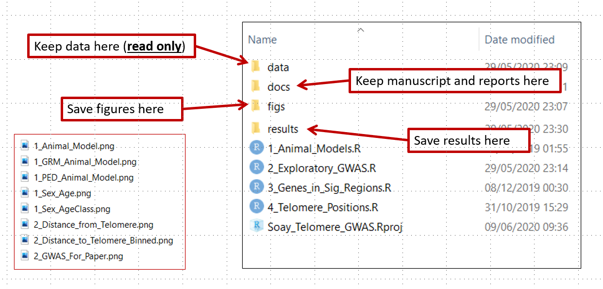

```{r setup, include=FALSE}
library(learnr)
```

```{css echo=FALSE}
.bordered{
  border: 1px solid #999
}
```

## Introduction

This tutorial is based on information from [Our Coding Club](https://ourcodingclub.github.io/) and [R4all](http://r4all.org/). The datasets for this tutorial can be downloaded from <https://github.com/susjoh/E4StatsTutorials>

### Why **R**?

**R** began its life in New Zealand in 1993 as a language and environment for statistical computing and graphics. It is an interpreted programming language, meaning that rather than pointing and clicking, the user types in commands. It is **free** and works across all platforms.

> "This is R. There is no if. Only how."\
> -- Simon 'Yoda' Blomberg, R-help (April 2005)

Almost anything is possible in **R**. It is fast becoming the *lingua franca* of academic research, statistics and data science. It is used for:

* Processing and tidying data (`dplyr`)
* Statistical analyses
* Data visualistion (`ggplot`)
* Creating interactive web applications (`shiny`)
* Generating reports and presentations (`knitr`, `slidify`)
* Creating portable projects (**RStudio** Projects)

The analytical power of **R** lies in its many packages (20,406 as of 12th Feb 2024). Hundreds of these are written for geoscience, ecology, evolutionary biology, chemistry, etc.. A list of packages are hosted on the Comprehensive R Archive Network (known as **CRAN**): <https://cran.r-project.org/>

## Getting Started: **R** and **RStudio**.

### Installing **R** and **RStudio**

**R** can be downloaded from the CRAN website. Whilst the CRAN download version provides a simple user interface, we recommend that **R** is run through the software **RStudio** This is open-source, free, and available [here](http://www.rstudio.com/).

### Creating an **R** Project.

Using **R** Projects (`.RProj`) allows easier file imports, improved reproducibility and collaboration. This is because it tells **R** where to look for data files and scripts, meaning that a script can be run different machines and environments without any problems. Projects can be created using `File > New Project` and following the instructions.

This will create a file with the extension `.RProj` in it's own folder. Opening this file will open **RStudio** within that folder.

On the Files tab in the **lower right**, you will see the files in the current working directory. This will be useful later when we tell **R** to load files. You can check the working directory by typing `getwd()`.

Create a new **R** Script (`File > New File > R Script`). **RStudio** should look like this:

{width="100%"}

***Figure 1. The RStudio Environment. Adapted from OurCodingClub.github.io***

On the **lower left** is the **Console** pane - this is the engine of **R**. You can give instructions to **R** by directly typing at the prompt (`>`).

On the **upper left** is your **R** Script - here, you can write commands and send them to the console by clicking `Run` or by typing `Ctrl-Enter`. `#` is the comment character in **R**.

On the **lower right**, you can browse the packages installed on your machine, open files and search **R** Help. This pane will also show plots when we run them later in the practical.

### Structuring an **R** Project.

Using a good project layout keeps the data reliable, portable and reproducible. This makes it easier for you or a collaborator to pick up the project after a break. There is no single way to structure a project, but an suggestion is shown in Figure 2. This is based on a blog post on Nice R Code available [here](https://nicercode.github.io/blog/2013-04-05-projects/).

{width="100%"}

***Figure 2: Example structure for a portable R project.***

* `data` contains all data used in the analysis and should be treated as **read only** - these files should never be edited or overwritten. Rather, they should be processed within R scripts.
* `docs` contains the paper and/or reports associated with the analysis (in Word, R Markdown, LaTeX, etc).
* `figs` contains any figures generated by R scripts.
* `results` contains any simulation outputs, processed data etc. NB. Data in `figs` and `results` can be treated as disposable.
* `[filename].R` are R scripts. You can split your workflow into units that are logical for you, such as (a) load, merge and clean data, (b) analyse the data and (c) create outputs such as results tables and figures. Some researchers use a numbering method so that the order in which to run different scripts is clear.
* `[filename].Rproj` is the portable R project.

\*\* The take-home message is to start your analysis from copies of the raw data, doing any cleaning, transforming, merging and so on in scripts. Always comment and document your code thoroughly, explain what it is doing and why.\*\*

<div class="bordered">

### **Exercise 1**

Try running some basic commands directly in the console and from the **R** Script:

```{r Ex901, exercise = TRUE}
2+3
1:10
seq(from = 1, to = 20, by = 4)
mean(c(3, 6, 9, 3, 6, 7))
```

Let's assign a sequence of numbers to an object, `x`:

```{r Ex902, exercise = TRUE}
x <- 1:10
x
y <- seq(from = 0, to = 4.5, by = 0.5)
y
```

You can see that in the upper right pane, we can see this new objects `x` and `y` in the environment.

#### Advanced Exercise

Read the next short paragraph on finding help within R. Use this information to generate two vectors of length 100.

`x` is normally distributed with a mean of 0 and a standard deviation of 1.

`y` is uniformly distributed with a range between 0 & 1.

</div>

### Finding Help within **R**.

The fastest way to find help in **R** is to search using `?`. For example:

```{r eval = F}
?mean
```

should bring up a help page for the function `mean()` in the lower right corner. Typing two question marks will search all help files and return a list of those that match.

```{r eval = F}
??mean
??"standard error"
```

<div class="bordered">

### **Exercise 2.**

* Using only `?` and/or `??`, find a function for calculating the standard deviation. What is the standard deviation of `x`?

* Using `?`, find the help file for the `sort()` function. Sort `x` and `y` in reverse order.

</div>

### Troubleshooting and finding help outside of **R**.

-   [Coding Club Tutorials & Useful Links](https://ourcodingclub.github.io/)
-   [Stack Overflow](https://stackoverflow.com/): Try searching with the tag [R]
-   [**RStudio** Cheatsheets](https://www.rstudio.com/resources/cheatsheets/)

## The Tidyverse.

{width="100%"}

In these practicals, we are going to use a suite of packages known as the `tidyverse`. These can be installed by running the following:

```{r eval = F}         
install.packages(tidyverse)
```

This installs the library from CRAN. It may ask you to select a mirror - select the one that which is geographically closest, or the RStudio Global mirror.

Each time we use R, we need to load the `tidyverse` package. It is good practice to do this at the beginning of the script when you are setting up the working environment.

```{r, message = F}
library(tidyverse)
```

There are three sub-packages within the tidyverse that are used within this practical:

* `readr` - this is a fast way to read in and save "rectangular" data.
* `dplyr` - a package for common data manipulation tasks.
* `ggplot2` - the industry standard for data visualisation.

## Loading data into **R**.

In the folder `data`, you have been provided with a single dataset on Peruvian Soil in two common formats - `Peru_Soil_Data.txt` (tab-delimited) and `Peru_Soil_Data.csv` (comma-delimited).

Using **R** Projects means that the working directory is the same as the .Rproj file. We will use `read_delim()` to read in the data-set. Try typing the following into your script, and guiding the command to the `.csv` version of the data file using the `Tab` key:

```{r eval = F}
Peru_Soil_Data <- read_delim("
```

You should now have the following code in your script:

```{r message = F}
Peru_Soil_Data <- read_delim("data/Peru_Soil_Data.csv")
```

You can also use the base R function `read.table()` which offers more flexibility on defining various features about the input files.

<div class="bordered">

### Exercise 3.

* Read the file `Peru_Soil_Data.txt` into **R**. Check the loaded object using the `head()` function. Do you need additional arguments to read in the file properly?

* The object `Peru_Soil_Data` is a type of object known as a **data frame**. You should ALWAYS check the data visually by clicking on its entry in the Environment tab, and/or using functions in base **R** for exploring data e.g. `head()` and `str()` and `glimpse()`. Try these out.

#### Advanced Exercise

* Read in `data/Peru_Soil_Data.txt` with `read.table()`. If it doesn't work, check the help file. If it does work, has all the data read in properly?

* Read in `docs/Peru_Soil_Data_Problematic.txt` with `read.table()`. If it doesn't work, check the help file. If it does work, has all the data read in properly?

</div>

## Data management in **R**.

Exploring and manipulating data is fundamental to data analysis. In this section, we will briefly cover how to sort and filter the soil dataset. There are several approaches to doing this in the base code of **R**, but here we will use on the functions `select()`, `filter()` and `arrange()` from the tidyverse package `dplyr`.

### Sorting data with `arrange()`

There are occasions where it is useful to have sorted data, either because we would like to examine it, or for some types of statistical analyses i.e. with time-series data. The `arrange()` function sorts data frames as so:


```{r eval = F}

# sort by Soil pH value:
arrange(Peru_Soil_Data, Soil_pH) 
# sort by decreasing Soil pH value:
arrange(Peru_Soil_Data, -Soil_pH) 
# sort by habitat and then soil pH within habitat:
arrange(Peru_Soil_Data, Habitat, Soil_pH) 
```

These can be saved back to the `Peru_Soil_Data` object like so:

```{r eval = F}
Peru_Soil_Data <- arrange(Peru_Soil_Data, Habitat, Soil_pH) 
```

### Sub-setting columns with `select()`

A convenient way to choos which columns you want is to use the `dplyr::select()` function, which will select or remove columns of the data. Try running:

```{r eval = F}
select(Peru_Soil_Data, River_Basin)
select(Peru_Soil_Data, -River_Basin)
```

More than one column can be selected or removed by adding more column names:

```{r eval = F}
select(Peru_Soil_Data, River_Basin, Magnesium, Sodium)
select(Peru_Soil_Data, -River_Basin, -Magnesium, -Sodium)
```

### Adding columns.

New columns can be added to the data containing information or calculations that you are interested in. We can do this in **R** using the code `$`, which can be used to call existing variables from a data frame. For example, river basin can be called as so:

```{r, eval = F}
Peru_Soil_Data$River_Basin
```

Columns can be added by creating new variables within the data frame. Here, we can create a new column called `log_Calcium` which takes the log_10 of the Calcium column:

```{r, eval = F}
Peru_Soil_Data$log_Calcium <- log10(Peru_Soil_Data$Calcium)

head(select(Peru_Soil_Data, Site, Calcium, log_Calcium))
```

### Sub-setting rows with `filter()`

Sub-setting data by rows is one of the most common tasks carried out in data manipulation steps.  For this, we can used the `filter()` function, specifying an argument with the following logical operators:

| Operator | Function                 |
|----------|--------------------------|
| `<`      | less than                |
| `>`      | greater than             |
| `=<`     | less than or equal to    |
| `=>`     | greater than or equal to |
| `==`     | equals                   |
| `!=`     | does not equal           |
| `%in%`   | matches                  |

For example, in the soil data, we may wish to select only rows for the floodplain habitat and the Los Amigos River Basin:

```{r eval = F}
filter(Peru_Soil_Data, Habitat == "floodplain", River_Basin == "Manu")
```

Or perhaps just the Calcium values greater than 50
```{r eval = F}
filter(Peru_Soil_Data, Calcium > 50)
```

<div class="bordered">


### **Exercise 4.**

1.  Create a new data frame, `Peru_Upland_Soil`, which includes row only from upland habitats.

2.  Edit this data frame so that it only includes data from the Manu and Los Amigos river basins (Hint: use `%in%`)

3.  Edit this data frame again so that it is sorted by increasing Calcium levels.

4.  Create a new column called `Sum_Ca_Mg` that is the sum of the calcium and magnesium columns.

5. Save your new dataset to a file in a directory `results` using `write_delim(..., sep = "\t")`. What do you think `\t` means? Try with and without this argument.

#### Advanced Exercises

6.  Explore the `group_by()` and `summarise()` function in `dplyr` using `?` or a search engine. Use these functions to create a data frame with the mean Phosphorus and Calcium measures for each habitat.


</div>

## Data visualisation with `R`

Data visualisation is the visual representation of data in the form of plots, charts, maps and infographics. It is an accessible way to identify patterns and trends in your data, but can also tell you about the quality of your data and how it should be analysed.

Data visualisation is an important part of our every day lives e.g such as on the BBC News (who use R to produce their graphics - see [here](https://bbc.github.io/rcookbook/) on how they do it!)

One of **R**'s most powerful tools is its ability to produce publication quality graphics in an automated and reproducible way.

### The first step of any analysis: PLOT YOUR DATA!

A good illustration of why this is important is using a dataset called the Anscombe's Quartet:


Each of these 4 data sets has almost identical results for linear regression (R2, slope and intercept). How would you change your data analysis based on the patterns that you visualise?

### Simple graphics in R (base graphics)

One of **R**'s most powerful tools is its ability to produce publication quality graphics in an automated and reproducible way.

Base **R** contains graphical tools for simple, exploratory graphics. These are easily called with functions such as `hist()` and `plot()`:

```{r eval = F}

# histogram
hist(Peru_Soil_Data$Calcium)

# plot
plot(Magnesium ~ Calcium, data = Peru_Soil_Data, col = "red")

# boxplot
boxplot(Magnesium ~ River_Basin, data = Peru_Soil_Data)
```

You can do many things you require in base graphics, but common actions and customisation are difficult. Base graphics are good for quick data exploration, but for everything else we recommend the graphics library `ggplot2`. If you want to explore customisation of base graphics, you can access my tutorial [here](https://rstudio-pubs-static.s3.amazonaws.com/7953_4e3efd5b9415444ca065b1167862c349.html).

## `ggplot2` - the grammar of graphics.

`ggplot2` is a plotting system in **R** which aims to take the best parts of base graphics and allow for easy plot customisation. It has extensive documentation and examples [here](https://ggplot2.tidyverse.org/reference/index.html).

{width="100%"}

The beauty of `ggplot2` is that you can build up the graph in different steps. The main steps can be summarised as follows:

{width="100%"}

\* NB. every geom has a default statistic, so this component is not always specified.

## `ggplot2` basics - a scatterplot with `geom_point()`

We will use the Palmer Penguin data set to explore relationships between various continuous and discrete traits. Here are the penguins; click [here](https://allisonhorst.github.io/palmerpenguins/) for more info on this dataset. 


The dataset can be used in R by installing as follows:

```{r eval = F}
install.packages("palmerpenguins")

```

Load the library and look at the `penguins` data frame.

```{r message = F}
library(tidyverse)
library(palmerpenguins)
data(penguins)
head(penguins)

```

### Let's plot!

We are going to plot **bill length** against **bill depth**.

The first step is to specify our `penguins` dataset in `ggplot2()`:

```{r Ex4, exercise = T, echo=F}
ggplot(penguins)
```

Then specify the aesthetic properties using `aes()`. In a scatterplot, we have x and y variables, which was specify as follows:

```{r Ex5, exercise = T}
ggplot(penguins, aes(x = bill_length_mm, y = bill_depth_mm))

```

You can see by running this line alone, we have already run into a problem - there is no data plotted on the graph! This is because ggplot doesn't know what type of graph we want. We need to specify the `geom` i.e. the type of plot. For a scatterplot, this is `geom_point()`. We add this to our first layer with a `+` sign:

```{r Ex6, exercise = T}

ggplot(penguins, aes(x = bill_length_mm, y = bill_depth_mm)) +
  geom_point()

```

Note that it is common practise to put anything separated by `+` onto a new line. This way, you can build up the graph line by line.

### Adding a statistical test with `stat_smooth()`

The function `stat_smooth()` is built to "aid the eye in seeing patterns" in your data. Let's have a go by adding it as a new layer in our plot:

```{r Ex14, exercise = T}

ggplot(penguins, aes(x = bill_length_mm, y = bill_depth_mm)) +
  geom_point() +
  stat_smooth()

```

The default of this function is to do what is called a "loess" smoothing, a type of moving regression. Sometimes this is useful, but in our case it is *not* useful. We need to specify that we want to use a linear regression.

We know that calling a linear regression can be done with `lm()`, which gives the intercept and slope:

```{r}
lm(bill_depth_mm ~ bill_length_mm, data = penguins)
```

We can add a linear regression to our graph by specifying that we want to use `lm()` as our smooth function. We do this with `stat_smooth(method = "lm")`:

```{r Ex15, exercise = T}

ggplot(penguins, aes(x = bill_length_mm, y = bill_depth_mm)) +
  geom_point() +
  stat_smooth(method = "lm")

```

This runs a regression for us and plots the regression line and a shaded standard error. This indicates the amount of "wobble" in the line covers the 95% confidence interval. Our results show that bill length decreases with bill depth.

Do you think this is true??  Let's explore some more...

### Colour by a categorical variable.

A common action in R is to colour variables by a categorical or quantitative aspect of the data, in this case, `species`. 

In this case, because species is defined in the dataset `penguins`, it is an aesthetic property of the data. Therefore, it has to be specified in `aes()`. We can add this using `col =` in the first line:

```{r Ex10, exercise = T}

ggplot(penguins, aes(x = bill_length_mm, y = bill_depth_mm, col = species)) +
  geom_point() +
  stat_smooth(method = "lm")

```

As you can see, the linear regressions are now grouped by their respective species. In this way, plotting our data showed us a new pattern that bill length and bill depth increase with each other within species. This highlights that you should ALWAYS EXPLORE AND PLOT YOUR DATA!

### Customisation

This graph looks good, but not amazing. We can now start to make modifications to improve the look of the graph.

#### Labels

We need to update the labels to something more meaningful. We can add this with `+ labs()`. Remember to put text in " "!

```{r Ex7, exercise = T}
ggplot(penguins, aes(x = bill_length_mm, y = bill_depth_mm, col = species)) +
  geom_point() +
  stat_smooth(method = "lm") +
  labs(x = "Bill length (mm)", y = "Bill depth (mm)")
```


#### Faceting

One nice feature of `ggplot2` is that you can facet your data based on a categorical variable. Let's go back to a simple graph again, and add the line `facet_wrap()` specifying `species`:

```{r Ex12, exercise = T}

ggplot(penguins, aes(x = bill_length_mm, y = bill_depth_mm, col = species)) +
  geom_point() +
  facet_wrap(~species)

```

### The finished graph

We can then combine the modifications we made above to make the full graph:

```{r}

ggplot(penguins, aes(x = bill_length_mm, y = bill_depth_mm, col = species)) +
  geom_point()+
  stat_smooth(method = "lm") +
  labs(x = "Bill length (mm)", y = "Bill depth (mm)") +
  facet_wrap(~species)

```

### Troubleshooting:

-   Did you forget a `+` ?
-   Is `+` at the end of the line?
-   Did you put text into inverted commas?
-   Anything in `aes()` does not need inverted commas.
-   Labels and colours need inverted commas.


### Saving a plot.

You've spent time making a nice plot - but how to save it? You can save by pointing and clicking in RStudio, but this becomes time consuming. A simpler way is to use `ggsave()`. This will save the most recently created plot. At the simplest level, you just specify a filename (`.png`, `.pdf`, `.jpg`):

```{r eval = F}

ggplot(penguins, aes(x = bill_length_mm, y = bill_depth_mm, col = species)) +
  geom_point()+
  stat_smooth(method = "lm") +
  labs(x = "Bill length (mm)", y = "Bill depth (mm)")
  facet_wrap(~species)
  
ggsave("figs/bill_morphology_plot.png")

```

This will automatically save with the dimensions that you have in your plot window. You can save with a fixed width and height as follows:

```{r eval = F}

ggsave("figs/bill_morphology_plot.png", width = 15, height = 10, units = "cm")

```

<div class="bordered">

### Exercise 5.

1. Create a scatter-plot of bill depth against flipper length. Colour the points based on bill length. Can you change the colour range to go from red to purple by adding the line `scale_colour_gradient()`?

2. Find a `geom_...()` to make a **histogram** of flipper_length_mm.

```{r echo = F, message = F, warning=F, fig.width = 4, fig.height = 3}
ggplot(penguins, aes(x= flipper_length_mm)) +
 geom_histogram()

```


3. Find a `geom_...()` to make a **box-plot** of species (x-axis) and flipper_length_mm (y-axis).

```{r echo = F, message = F, warning=F, fig.width = 4, fig.height = 3}

ggplot(penguins, aes(x = species, y = flipper_length_mm)) +
 geom_boxplot()

```

4. Colour the bars in the previous plot by `sex` (Hint: swap `col` for another command). If you want to remove NAs, create a filtered dataset using `penguins_v2 <- filter(penguins, !is.na(sex))`.

```{r echo = F, message = F, warning=F, fig.width = 4, fig.height = 3}
penguins_v2 <- filter(penguins, !is.na(sex))

ggplot(penguins_v2, aes(x = species, y = flipper_length_mm, fill = sex)) +
 geom_boxplot()

```

5. Use the tab key to explore options for the layer `theme_...()` and use it to make your graphs look nicer. (My go-to is `theme_bw()`)

### Advanced exercises

6. Facet by species and change the axes so that the scales are not fixed on each facet (i.e. the scales are different and not the maxima of the entire plot area)? Hint: look at the specifications in `facet_wrap()`.

```{r echo = F}

ggplot(penguins_v2, aes(x = species, y = flipper_length_mm, fill = sex)) +
 geom_boxplot() +
 facet_wrap(~species, scales = "free")

```

7. Create a scatterplot with any continuous variables, coloured by species.

* Using `theme()`, try to:
  * Orientate the x axis labels to 90 degrees.
  * Place the legend at the top of the graph, and/or remove it altogether.
  * Make the axis title size bigger.
  * Turn the plot background to be "lightblue".

* Using `geom_point`, try to:
  * Change the shape, size and transparency of the points.

</div>
