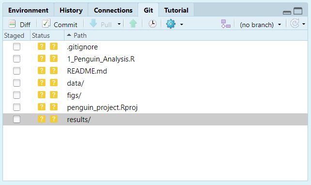

```{r setup, include=FALSE}
library(learnr)
library(ggplot2)
library(dplyr)
inline <- function(x = "") paste0("`` `r ", x, "` ``")
```

```{css echo=FALSE}
.bordered{
border: 1px solid #999
}
```

## Introduction

This tutorial is based on [R4all](http://r4all.org/) and [Our Coding Club](https://ourcodingclub.github.io/). It will explore how to write reports in **R** Markdown. By the end, you should be able to:

* Write, embed and render code and results into a document.
* Version control your scripts using `git`.

We will continue to use the [Palmer Penguin](https://allisonhorst.github.io/palmerpenguins/) data set to explore relationships between various continuous and discrete traits.


### Getting Set Up.

For this practical, we will use RStudio in Noteable. You can also do this on your machine if you have `Git` installed from [here](https://git-scm.com/book/en/v2/Getting-Started-Installing-Git)

1. Create a new project called `penguin_project` by clicking `File > New Project... > New Directory > New Project`. Make sure that the option `Create a git repository` is selected:

{width="60%"}
2. Make sure you have the Palmer penguin dataset installed and loaded by typing the following in the Console (bottom left pane):

```{r eval = F}
install.packages("palmerpenguins")
library(palmerpenguins)
data(penguins)
head(penguins)
```


## Writing reports with R Markdown.

**R** Markdown is a tool for writing reproducible reports in **R**.

{width="60%"}

It uses the `knitr` library by [Yihui Xie](https://yihui.name/knitr/) to produce documents with embedded code and figures in HTML, Word and PDF format. It can also be used to create webpages and presentations.

Some great examples of what can be achieved are shown [here](https://r4ds.had.co.nz/r-markdown-formats.html).

### Creating an **R** Markdown Document.

Open RStudio and create a new markdown document by going to: `File > New File > R Markdown...`

{width="50%"}

In the window, name your document, select `HTML` and click `OK`. RStudio should automatically create a template of an example R Markdown document analysing the `cars` data set. Take a look.

To "render" the script into a document, click `Knit` and save when prompted. You will see that it produces an HTML document with embedded figures, based on the text and code within the Markdown file. Easy peasy!

Take some time to familiarise yourself with how the script matches to the output. 

### Essential Tips:

* "Knitting" opens a new analysis session in the background. It will only work if your script can run from beginning to end with no errors.

* It is possible to carry out basic formatting as well as adding headings, tables, lists and external figures. For the very basics of Markdown, go to `Help > Markdown Quick Reference`.

* You can access very detailed cheatsheets through `Help > Cheatsheets > R Markdown Cheat Sheet`.

* You can render to MS Word or PDF (NB. the latter requires a TeX install on your machine).

* A convenient feature in RStudio is the `Show document outline` in the top right corner of the window pane.

* You can do this in a normal R script by clicking `Compile Report`:
{width="50%"}

<div class="bordered">

### **Exercise 1**

Create a new, blank **R** Markdown Script with the following header:

```
---
title: "Palmer Penguins Analysis"
author: "Your Name"
date: "2024-02-26"
output: html_document
---
```

Using `Help > Markdown Quick Reference` to help you, add text with basic formatting (e.g. `*italic*`, `**bold**`). Add headers for Introduction, Methods, Results, etc.

<font color="blue">**Feeling advanced?**</font>: For this practical, create a slideshow or tutorial instead of an HTML document, using `File > New File > R Markdown... > Presentation` etc.

</div>

### Embedding code in R Markdown.

Code can be embedded into the document in two ways.

First, it can be embedded as a **"chunk"**: 

    ```{r}`r ''`
    head(penguins)
    ```

Second, it can be embedded as inline code:

> Two plus two equals `r inline("2 + 2")`.

which will print

> Two plus two equals 4.

As you have seen in the example, there can be several code chunks within a document. This is how it works:

1. Running the `.Rmd` document opens a new R session.

2. Each chunk is run in order and saved in the environment: all libraries and new objects are saved in the workspace for all subsequent chunks.

3. When clicking `Knit`, RStudio assumes the directory containing the file is the working directory. 

4. All chunks in the document must be able to run without any errors, or the document will not render.

### Structuring an R Markdown document.

The first chunk in your Markdown document is a good place to load libraries and data.

In this practical, we will use the libraries `ggplot2`, `dplyr` and `palmerpenguins`. Put this chunk after the header of your document and click `Knit`:

    ```{r}`r ''`
    library(ggplot2)
    library(dplyr)
    library(palmerpenguins)
    ```
    
You may notice that this results in messages that is not relevant to the document. You can control what is reported using additional arguments within the chunk description. For example, the following will allow the command to run invisibly:

    ```{r include = F}`r ''`
    library(ggplot2)
    library(dplyr)
    library(palmerpenguins)
    ```
It can also control how results and figures are presented. Try adding a new chunk and `knit`ting:

    ```{r}`r ''`
    str(penguins)
    ggplot(penguins, aes(x = bill_length_mm, y = flipper_length_mm)) + geom_point()
    ```
and then replacing it with the following, and `knit`ting again:

    ```{r echo = F, results = "hide"}`r ''`
    str(penguins)
    ggplot(penguins, aes(x = bill_length_mm, y = flipper_length_mm)) + geom_point()
    ```

This will hide the code (`echo = F`) and code output (`results = "hide"`).

Some common options are given here:

Command  |  Description
---------|-------------
`eval = FALSE` | Means that the code will not be run and no results generated. This is useful for displaying example code or for disabling code.
`include = FALSE` | Runs the code but hides the code and results in the knitted document. Good for code you don't want to clutter your report (e.g. loading libraries, data etc)
`echo = FALSE` | Hides the code but shows the results.
`message = FALSE` or `warning = FALSE` | Hides messages or warnings that might appear in the finished file.
`results = 'hide'` | Hide printed output; `fig.show = 'hide'` hides plots.
`error = TRUE` | Causes the render to continue even if code returns an error. NB. Use this with caution!
`fig.width`, `fig.height` | Specify the size of output plots.

### Other Points to Note:

* Code in **R** Markdown chunks can be run in the console as in a normal script

* In RStudio, the default option is to show code output and figures in your script. To switch this function on and off, go to `Global options > R Markdown > Show output inline for all Markdown documents` and select your preferred setup.

* Want to learn more? More detailed information on this can be found at the [Coding Club tutorial](https://ourcodingclub.github.io/tutorials/rmarkdown/) and the online [R for Data Science](https://r4ds.had.co.nz/r-markdown.html) book.


<div class="bordered">

### **Exercise 2**

Can you edit this chunk to hide the code, hide the warning message, and adjust the height and width of the plot to make it smaller?

    ```{r}`r ''`
    ggplot(penguins, aes(x = bill_length_mm, y = flipper_length_mm)) +
    geom_point()
    ```

</div>

## A very brief overview of Git


## Version control with `git`.

###What is `git`?

[](images/git_0_screenshot.png)

`Git` is a commonly used version control programme. You may have heard of [GitHub](https://github.com) - this website provides access to versions of code, but also allows collaborative working, through bug reports, requests, task management, etc.

When you look at the upper right hand pane of RStudio, you may have a tab that says **Git**. If not:

0. Check you installed git by typing `git` into the **Terminal** tab in the lower left hand pane. If nothing appears, install git to your machine using the instructions at the start of the practical (or in Noteable, make a new project with git enabled).
1. Go to `Tools > Project Options... > Git/SVN > Version Control System: Select “Git”`. You will probably have to restart RStudio.
2. If this isn't an option but you installed git, try closing and re-opening RStudio.
3. Ask me and I'll try to help!

The pane should look something like this:



FYI: the `.gitignore` file is a text file specifying files and directories that git should ignore - for example, your .Rhistory, .RProj files and so on. For example, if you have very large data or results files, you may not want to commit them to save disk space.

### The first commit

Click on the boxes under the column `Staged`. These should turn from question marks to a green `A`. This means that you have added these files to the repository. Click `Commit`. A new dialogue should appear:

{width="80%"}

Type in a commit message (such as "First commit") and click "Commit". The dialogue should clear and the `Git` tab should be empty. You have now saved a snapshot in time. You can see your History by clicking the `History` button on the Git tab (it has a little clock). 

### More commits

Let's make another commit. Edit your knitr/analysis file with something unimportant (maybe a comment) and save the file.

{width="80%"}

Now you will see your script with a blue `M` next to it. This means the file has been modified. (If you don't see it, press the little reload arrow at the far right of the pane). Stage it and commit it with a *meaningful* commit message. You will see the file changes in the lower part of the box:

{width="80%"}

Look at the history again, and you will see the new edit. As you add more commits, you can click on previous versions of files to see the previous versions. You can also filter by file in the menu `(all commits)`.

### A few comments:

**Revisiting a previous commit**: You can click on the `History` tab and click on previous versions of files at each commit. You can also filter by file in the menu `(all commits)`.

**Reverting to the last commit**: If you have made edits but want to revert back to the last save, you can click on the file in `Git` and click `More > Revert`. Use carefully as you'll lose all your changes - it's better to commit the bad stuff with a clear commit message and retrieve a previous version.

<font color="blue">**Feeling advanced?**</font>: If you would like to try connecting your RStudio with GitHub, you can try another tutorial: https://github.com/susjoh/MScIntroGitGithub.


## Final Exercise: Using R as a Research Pipeline

Create a new script, save it to your main directory, and start exploring your research question. Refer to last weeks notes and be creative! Your goals are (indented are optional!):

* Load the libraries `ggplot2` for plotting, `dplyr` for data manipulation, and `readr` for writing data to files.

<details><summary><font color="blue">Click for Hint</font></summary>
```
library(dplyr)
library(ggplot2)
library(readr)
```
</details>

* Load the `palmerpenguins` library and type `data("penguins")`.
  * Filter the data to only look at a particular species or sex.
  * Save this edited dataset in `results/`

<details><summary><font color="blue">Click for Hint</font></summary>
```
library(palmerpenguins)
data("penguins")

# Subset the data
penguins_edit <- filter(penguins, species == "Adelie")

# Make a results folder if you don't have one already...
dir.create("results")
write_tsv(penguins_edit, "results/1_penguins_no_chinstrap.txt")
```
</details>


* Choose variables to create a scatterplot with a linear regression with `ggplot()`.
  * Run a statistical test with `lm()`
  * Report the slope, intercept, P and adjusted R^2 values inline.
  * Save plot(s) to `figs/`

<details><summary><font color="blue">Click for Hint</font></summary>
```
# Make the plot
ggplot(penguins_edit, aes(bill_length_mm, bill_depth_mm)) +
  geom_point() +
  stat_smooth(method = "lm")
  
# Run a linear regression
fit1 <- lm(bill_depth_mm ~ bill_length_mm, data = penguins_edit)
fit1 <- summary(fit1)
fit1

# Intercept = 11.41, Slope = 0.179, P = 6.67e-07, Adj R^2 = 0.148

# These results can be called inline using numerous methods e.g. tidy() in library(broom). This is the old school way, which can be called inline with e.g.`r fit1$adj.r.squared`:

fit1$coefficients
fit1$coefficients[1,1]
fit1$coefficients[2,1]
fit1$coefficients[2,4]
fit1$adj.r.squared   

```
</details>

* Create a boxplot between a categorical and continuous variable, and run and report the results of a t-test using `t.test()`

<details><summary><font color="blue">Click for Hint</font></summary>
```
# Filter to just males and females
penguins_edit <- filter(penguins_edit, !is.na(sex))

# Make a plot
ggplot(penguins_edit, aes(sex, bill_depth_mm)) +
  geom_boxplot()

# Run a t.test  
fit2 <- t.test(bill_depth_mm ~ sex, data = penguins_edit)
fit2

fit2$statistic
fit2$parameter
fit2$p.value

```
</details>


* Knit to create an HTML document that gives a basic report of your data, analysis and results. Try to minimise unnecessary code and messages being pasted into your document.

If you are newer to R, use the hints to get started.

If you have some experience with R, try to do this without the hints!


<details><summary>**Subset the data:** [click]</summary>
```
penguins <- filter(penguins, Species != "Chinstrap")

```
</details>

<details><summary>**Run a linear regression:** [click]</summary>
```
model1 <- lm(body_mass_g ~ flipper_length_mm, data = penguins)
summary(model1)

```
</details>

<details><summary>**Create a nice plot in ggplot2:** [click]</summary>
```
ggplot(penguins, aes(x = flipper_length_mm, y = body_mass_g, colour = species)) +
  geom_point() +
  stat_smooth(method = "lm")    

```
</details>


<details><summary>**Save the plot in your /figs folder:** [click]</summary>
```
ggsave("figs/1_flipper_bodymass_regression.png") 

#NB. This saves the last plot that was run!

```
</details>


<details><summary>**Subset the data:** [click]</summary>
```

penguins_female <- subset(penguins, sex == "female")

```
</details>

<details><summary>**Save the edited dataset:** [click]</summary>
```

write_tsv(penguins_female, "results/1_penguin_female_only.txt")

```
</details>


